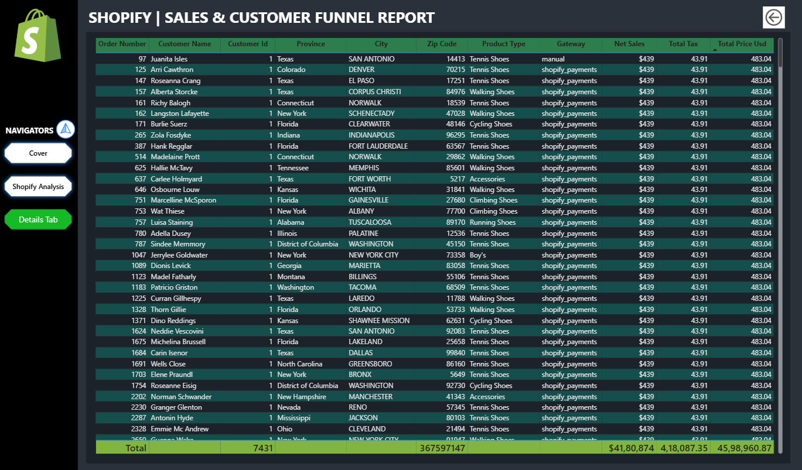

# Shopify Sales & Customer Analysis - Power BI Project

## 📌 Project Overview
This project uncovers valuable business insights from one week of Shopify sales data using **Power BI**.  
The analysis evaluates transaction performance, customer behavior, product trends, and payment preferences to support **data-driven decision-making**.  

The dashboard is designed to be interactive and dynamic, offering both high-level KPIs and drill-down capabilities for deeper exploration.

---

## 🎯 Business Objectives
- Evaluate overall **sales performance** and transaction efficiency.
- Understand **customer behavior** (repeat vs. single-order buyers).
- Track **product-wise and regional sales performance**.
- Identify **high-performing payment gateways**.
- Enable granular-level analysis for **marketing, stocking, and engagement strategies**.

---

## 📊 Key KPIs Tracked
- **Net Sales:** Total revenue generated before tax.  
- **Total Quantity:** Total number of products sold.  
- **Average Order Value (AOV):** Net Sales ÷ Number of orders.  
- **Total Customers:** Unique customer count.  
- **Repeat Customers:** Customers with more than one order.  
- **Lifetime Value (LTV):** Total spend per customer.  
- **Repeat Rate:** % of customers who made multiple purchases.  
- **Purchase Frequency:** Average number of orders per customer.  

---

## 🔍 Dashboard Insights

### **A. Transaction Performance**
- **Net Sales:** $41,80,874  
- **Average Order Value:** $562.6  
- **Total Quantity Sold:** 7,534  
**Insight:** Strong revenue and order value suggest high-ticket products or effective cross-selling.

### **B. Customer Behavior**
- **Total Customers:** 4,431  
- **Repeat Customers:** 2,039 (≈46%)  
- **LTV:** $943.6  
- **Purchase Frequency:** 1.68  
**Insight:** Nearly half of the customers are returning, suggesting potential for loyalty programs.

### **C. Sales Trends Over Time**
**Insight:** Time-of-day and daily patterns can inform marketing campaign timings.

### **D. Regional Sales Distribution**
**Top Cities:** New York, Houston, Dallas, Washington.  
**Insight:** Regional targeting can increase ROI.

### **E. Product Type Performance**
**Top-Selling Categories:** Running Shoes, Walking Shoes, Cycling Shoes.  
**Insight:** Athletic footwear is dominant.

### **F. Payment Gateway Preferences**
**Top Methods:**  
- Shopify Payments – 58.45%  
- PayPal – 22.29%  
- Gift Card – 17.62%  
**Insight:** Customers prefer Shopify Payments.

---

## ⚙ Technical Process
- Requirement Gathering  
- Data Cleaning  
- Data Modeling  
- DAX Measures  
- Dashboard Development  
- Insights Generation  

---

## 🛠 Tools & Technologies
- **Power BI:** Dashboard creation & DAX modeling  
- **Excel/CSV:** Raw data cleaning and verification  
- **DAX:** Calculated metrics and dynamic visuals  

---

## 🚀 Limitations & Future Scope
- The dataset covers **only one week of data**, limiting long-term trend forecasting.  
- Future improvements:  
  - Use **monthly/quarterly data**.  
  - Add **campaign performance & inventory insights**.

---

## 📌 Conclusion
This Shopify sales analysis provides critical insights into short-term sales behavior, **customer loyalty**, and **product performance**.  
The interactive dashboard helps management make **data-driven decisions** in sales, marketing, and inventory control.

---

## 📷 Dashboard Preview

